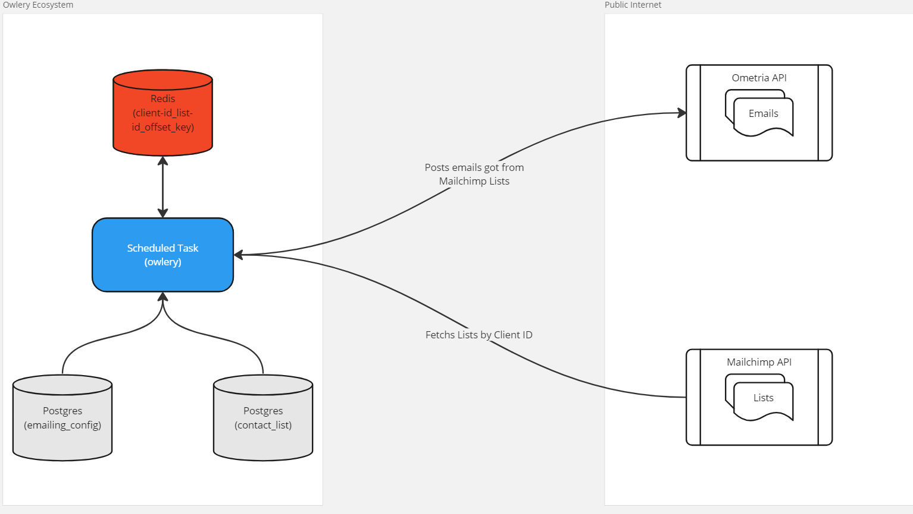

# owlery 🦉

Just like at Hogwarts, Owlery is where the owls that knows every destinations stays, trust them and you can reach anyone!


## How it works

Owlery is worker thought to be used as a Scheduled Task on a Cloud that reads a table `emailing_config` to fetch Clients IDs, so we can easily link List IDs from Mailchimp to them, finally pooling email addresses from all List IDs configured and sending it to Ometria's API.



## So how do I run it?

Ideally, a docker compose and running some SQL scripts we'd have all the tables and containers needed for it to work. But unfortunately I had problems making the service container communicate with PSQL container, and the lack of time and Network knowledge made me give up from this idea (for now, I'm still curious how to fix it tho).

Either way, let's do it the "on my machine works" way. The requisites are:

- Go 1.19^;
- Make;
- Docker.

**1. Dockerfile and Makefile:**

We should just edit both lines with the API KEYS so when we build using this routine the values will be stored in environment variables.

```dockerfile
ENV OMETRIA_APIKEY <ometria-api-key>
ENV MAILCHIMP_APIKEY <mailchimp-api-key>
```

Also, do the same on Makefile at the lines below:

```makefile
build:
	- go mod tidy
	- go get ./...
	- go build
	- export MAILCHIMP_KEY=<mailchimp-apikey>
	- export OMETRIA_KEY=<ometria-apikey>
	- ./owlery
```

Then, run ``make env`` to create the containers needed for the application.

**2. Creating tables:**

You gonna find some SQL scripts at  ``assets/sql``. Using the postgres container we just created in the previous step, you can run all scripts using the DB Manager of your preference (I used pgAdmin 4 because it's free). 

**Don't forget to create your database! I used the name ``custom`` for the database if you need a suggestion**

**3. Application config:**

Maybe you won't need this step, but check if the yaml at ``configs/application-local.yml`` has the connection directing to your containers, if you run and see some connection refused or similar errors, this file have the connection addresses the application needs.

**4. Run!**

Hit ``make build`` and let's pray!

## Final considerations

The test I did using the info sent by email with 50k emails at Mailchimp took ~5min considering it was on my local machine with good resources (bigger than a container but way smaller than a powerful VM). Since I imagine this running into a scheduled task, I'd say that having more workers to process more Clients from DB would be a must, also by default I'm pooling at most 500 email addresses per request to ometria API because I don't know the capability of the API's to process bigger lists, so raising this number would make the worker go faster but overload the API (trade offer!).